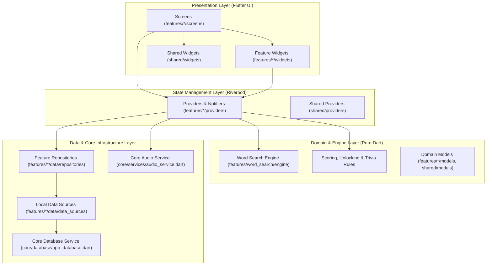
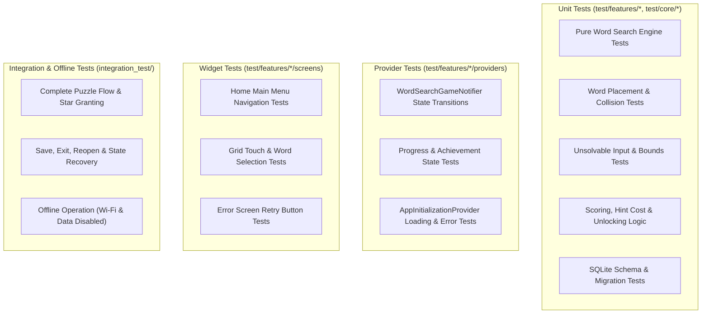

# Rehiyonia Implementation Plan

## 1. Purpose

This plan defines the architectural standards, folder organization, boundaries, and incremental execution strategy for **Rehiyonia: An Offline Educational Word Search Game for Philippine Regions** (targeting Grade 5 Araling Panlipunan learners).

This document serves as the sole source of architectural truth. It strictly separates **verified repository facts**, **stated project requirements**, and **future recommendations**.

> [!IMPORTANT]
> This revision updates this implementation plan document only. It does not reorganize, create, move, rename, or delete any Flutter source code, assets, platform folders, or database files.

---

## 2. Verified Project Constraints

| Item | Status | Evidence / Source |
|---|---|---|
| Package Name: `rehiyonia` | **Verified** | Declared in `pubspec.yaml` line 1 |
| SDK Environment: Dart `^3.13.1` | **Verified** | Declared in `pubspec.yaml` line 22; active Flutter runtime is Dart 3.13.1 / Flutter 3.47.1 |
| Primary Target Platform: Android | **Stated Requirement** | Verified that `android/` exists alongside Flutter-generated platforms (`ios/`, `web/`, `linux/`, `macos/`, `windows/`) |
| State Management: `flutter_riverpod` | **Verified Installed** | `flutter_riverpod: ^3.4.2` is present in `pubspec.yaml` and wired into `main.dart` with `ProviderScope` |
| Local Database: `sqflite` | **Future Requirement** | Not installed in `pubspec.yaml`; no database code currently exists |
| Local Audio: `audioplayers` | **Future Requirement** | Not installed in `pubspec.yaml`; no audio service code currently exists |
| Completely Offline Operation | **Stated Requirement** | Target audience is Grade 5 students; zero remote network calls permitted |
| Target Audience & Content | **Stated Requirement** | Philippine regional geography, provinces, capitals, landmarks, culture |
| Architectural Style | **Architectural Rule** | Feature-first architecture with strict layer decoupling and snake_case naming |

### Riverpod Dependency Standard

All state management across Rehiyonia must use:

```yaml
dependencies:
  flutter_riverpod: ^3.4.2
```

We specify `flutter_riverpod` (rather than plain `riverpod`) because Rehiyonia is a Flutter application requiring seamless integration with `ProviderScope`, `ConsumerWidget`, `ConsumerStatefulWidget`, `WidgetRef`, and Flutter lifecycle mechanics.

---

## 3. Audited Current State

Audit timestamp: **September 20, 2026**.

```text
rehiyonia/
├── .gitignore
├── analysis_options.yaml
├── android/
│   └── app/build.gradle.kts (applicationId = "com.example.rehiyonia")
├── ios/
├── linux/
├── macos/
├── web/
├── windows/
├── pubspec.yaml (dependencies: flutter, cupertino_icons, flutter_riverpod: ^3.4.2; dev: flutter_test, flutter_lints: ^6.0.0)
├── pubspec.lock
├── README.md
├── IMPLEMENTATION_PLAN.md
├── lib/
│   ├── main.dart
│   ├── app/
│   │   ├── app.dart (RehiyoniaApp root StatelessWidget)
│   │   ├── app_router.dart (AppRouter with initial home route)
│   │   └── app_theme.dart (AppTheme.light ThemeData)
│   └── features/
│       └── home/
│           └── screens/
│               └── home_screen.dart (HomeScreen with temporary Phase 1 counter)
└── test/
    └── features/
        └── home/
            └── home_screen_test.dart (Widget test testing counter increment with ProviderScope)
```

### Verified Repository Facts

1. **Phase 1 Structural Foundation In Place**:
   - `lib/main.dart` contains only initialization (`WidgetsFlutterBinding.ensureInitialized()`) and launches `runApp(const ProviderScope(child: RehiyoniaApp()))`.
   - Application shell is organized under `lib/app/`: `app.dart` (`RehiyoniaApp`), `app_router.dart` (`AppRouter`), and `app_theme.dart` (`AppTheme`).
   - `lib/features/home/screens/home_screen.dart` contains the temporary counter screen preserved during structural extraction.
   - `test/features/home/home_screen_test.dart` mirrors the home screen and tests counter incrementing inside `ProviderScope`.
   - The legacy `test/widget_test.dart` file has been migrated and no longer exists.
2. **Dependencies**:
   - Runtime: `flutter`, `cupertino_icons: ^1.0.8`, `flutter_riverpod: ^3.4.2`.
   - Dev: `flutter_test`, `flutter_lints: ^6.0.0`.
   - `sqflite`, `path`, and `audioplayers` are **not installed**.
3. **Android Configuration**:
   - Android Gradle DSL (`android/app/build.gradle.kts`) defines `applicationId = "com.example.rehiyonia"`.
4. **Git Version Control**:
   - The workspace is **not currently a Git repository** (`git status` reports `fatal: not a git repository`).
   - Standard `.gitignore` exists at project root.
5. **Quality & Analysis Baseline** (Executed September 20, 2026):
   - `flutter analyze`: **Passed with 0 issues**.
   - `flutter test`: **Passed (1 test: temporary counter increments)**.
   - `dart format . --output=none --set-exit-if-changed`: **Passed (6 files clean)**.
6. **Items Requiring Verification**:
   - `flutter build apk --debug`: **Requires verification** (unexecuted).
   - Real Android device/emulator launch: **Requires verification** (unexecuted).
   - Complete offline device operation: **Requires verification** (unexecuted).

---

## 4. Architecture Principles & Layer Boundaries

Rehiyonia follows a strict **Feature-First** architecture with decoupled layers:



### Core Architecture Rules

1. **Pure Dart Engine**: Game engines and rule validators must not depend on Flutter, `BuildContext`, widgets, navigation, Riverpod UI state, SQLite, or audio.
2. **Unidirectional Dependency Flow**: Presentation $\rightarrow$ State Management $\rightarrow$ Domain/Repositories $\rightarrow$ Core Services. Core never depends on features or shared presentation.
3. **Strict Separation of SQL**: No SQLite queries, raw SQL strings, or database helpers inside UI screens or widgets. All persistence must go through feature repositories and data sources.
4. **No Premature Repository Interfaces**: Create repository abstractions only when multiple implementations or mock test suites strictly require them. A direct, clean local repository class is preferred for single-implementation offline modules.
5. **No Empty Directories**: Directories must only be created when they house active Dart source or asset files.

---

## 5. Folder Responsibility Rules

```text
lib/
├── app/
├── core/
│   ├── constants/
│   ├── database/
│   ├── errors/
│   ├── services/
│   └── utils/
├── features/
└── shared/
    ├── models/
    ├── providers/
    └── widgets/
```

### 1. `lib/app/` (Application Shell)
- **Responsibility**: Top-level application bootstrap, global theme configuration (`app_theme.dart`), central declarative route definitions (`app_router.dart`), and root application widget (`app.dart`).
- **Restrictions**: Must not contain domain logic, game state, or feature screens.

### 2. `lib/core/` (Non-Visual Infrastructure)
- **Responsibility**: Shared non-visual mechanisms across the entire app.
  - `constants/`: Global game constants, database version numbers, asset key constants.
  - `database/`: SQLite connection management, migrations, schema definition, seed loader.
  - `errors/`: Custom exceptions (`DatabaseException`, `AudioException`, `ContentParsingException`) and failure models.
  - `services/`: Reusable cross-cutting services (e.g., `audio_service.dart`).
  - `utils/`: Pure utility helpers (date formatting, string helpers, mathematical routines).
- **Restrictions**: **DO NOT CREATE `core/widgets/`**. `core/` is strictly non-visual.

### 3. `lib/shared/` (Reusable Presentation & Shared State)
- **Responsibility**: Presentation components and cross-feature models used by two or more independent features.
  - `models/`: Shared value objects used across multiple domains (e.g., `PhilippineRegion`).
  - `providers/`: App-wide cross-feature providers (e.g., global coin balance provider).
  - `widgets/`: Reusable design-system UI components (e.g., `RehiyoniaButton`, `StarRatingBar`, `PhilippinePatternBorder`).
- **Restrictions**: Feature-specific widgets must NEVER be placed in `shared/widgets/`. Move widgets to `shared/widgets/` only upon actual verified reuse.

### 4. `lib/features/` (Feature Slices)
Each feature manages its own functional domain. Features create subdirectories only when populated:

```text
features/feature_name/
├── data/
│   ├── data_sources/       # Local SQLite or JSON asset readers
│   └── repositories/       # Concrete feature repository
├── models/                 # Feature-specific models
├── providers/              # Riverpod StateNotifiers / AsyncNotifiers
├── screens/                # Routable screen widgets
├── services/               # Feature-specific rules or helpers
└── widgets/                # Widgets private to this feature
```

### 5. Audio Ownership Boundary
- **Playback & Lifecycle**: Handled exclusively by `lib/core/services/audio_service.dart`. It wraps `audioplayers`, controls sound-effect pools, manages looping background music, and handles audio focus and release.
- **Preferences & Settings**: The Settings feature (`features/settings/`) owns user preferences (`audio_preferences.dart`), toggles (`settings_provider.dart`), and preference UI (`settings_screen.dart`).
- **Rule**: UI widgets must never instantiate or manipulate audio players directly.

### 6. Database Initialization Boundary
Database initialization must not blindly block application startup. Two valid strategies are permitted, subject to Phase 2 approval:

#### Option A: Simple Synchronous-like Pre-runApp Initialization
- Database initialized in `main()` before `runApp()` only if local SQLite opening and migration checks are lightweight and fast (<150ms).
- Must include a `runZonedGuarded` or explicit try/catch to present a fallback startup error widget if database open fails.

#### Option B: Provider-Controlled Asynchronous Initialization (Recommended)
- Application launches immediately with `runApp()`.
- A Riverpod initialization provider (`app_initialization_provider`) orchestrates database opening, version migration, and asset seed verification.
- The UI layer reacts with:
  1. A branded splash / loading screen while initializing.
  2. A recoverable error screen with a clear "Retry" action if opening fails.
  3. Seamless navigation to Home/Menu upon readiness.
- **Rules**:
  - Prevent feature screens or repositories from executing queries before initialization completes.
  - Keep database initialization logic out of feature screens.

### 7. Word Search Engine Boundary
The Word Search engine must remain pure Dart and located under:

```text
lib/features/word_search/
├── engine/
│   ├── grid_generator.dart      # Matrix generation & letter placement
│   ├── selection_validator.dart # Coordinate selection & angle checking
│   ├── word_placement.dart      # Direction vectors & collision detection
│   └── word_search_engine.dart  # Pure puzzle generation facade
├── models/                      # WordSearchPuzzle, PuzzleCoordinate, etc.
├── providers/                   # WordSearchGameNotifier, TimerNotifier
├── screens/                     # WordSearchScreen
└── widgets/                     # LetterGridView, WordListBar
```

- **Rules**:
  - The engine accepts plain Dart values (`WordSearchConfig`, `List<String> words`, `int rows`, `int cols`) and returns pure Dart structures (`WordSearchPuzzle`).
  - It must have **zero imports** of `package:flutter/material.dart`, `package:flutter_riverpod`, `sqflite`, or `audioplayers`.
  - It has no knowledge of player coins, stars, or regional campaign unlock state.

### 8. Final Challenge Dependency Rule
The Final Challenge feature tests master regional knowledge by generating large, composite puzzles across multiple regions.

- **Allowed Direction**:
  ```text
  features/final_challenge ────▶ features/word_search/engine (pure Dart)
  ```
- **Forbidden Dependencies**:
  - `final_challenge` must NEVER import `word_search_screen.dart`, regional Word Search providers, regional navigation state, or UI widgets from `word_search`.
  - `word_search` must NEVER import `final_challenge`.
  - If direct feature-to-feature engine imports become unwieldy, extract the pure engine to a neutral domain location (e.g., `lib/shared/game_engine/`), but do not do so prematurely.

### 9. Temporary Counter Lifecycle Rule
The default Flutter counter screen (`lib/features/home/screens/home_screen.dart`) is retained **only during Phase 1** to guarantee that the structural extraction into `lib/app/` and `lib/features/home/` does not break existing behavior.
- In Phase 3 (Feature Implementation), when the genuine Rehiyonia Main Menu / Home Screen is built, all counter logic, button handlers, counter text, and counter widget tests **must be completely removed**.
- No placeholder or counter remnants may exist in the production game.

---

## 6. Revised Phased Implementation Plan

### Phase 1: Reorganize the Default Scaffold (Completed & Audited Baseline)

- **Goal**: Safely extract the default Flutter starter into standard `app/` and feature-first `home/` layers, establish the Riverpod foundation, and verify regression-free execution.
- **Scope**:
  - Establish safety baseline.
  - Implement `lib/app/app.dart`, `app_router.dart`, and `app_theme.dart`.
  - Encapsulate temporary counter in `lib/features/home/screens/home_screen.dart`.
  - Wire `flutter_riverpod` with `ProviderScope`.
  - Mirror widget test under `test/features/home/home_screen_test.dart`.
- **Audited Status**: **Files already implemented and passing verification in repository.**
- **Proposed / Current File Structure**:
  ```text
  lib/
  ├── main.dart
  ├── app/
  │   ├── app.dart
  │   ├── app_router.dart
  │   └── app_theme.dart
  └── features/
      └── home/
          └── screens/
              └── home_screen.dart
  test/
  └── features/
      └── home/
          └── home_screen_test.dart
  ```
- **Migration Map**:
  | Original Scaffold File | Phase 1 Mapped Location | Rationale |
  |---|---|---|
  | `MyApp` in `lib/main.dart` | `lib/app/app.dart` (`RehiyoniaApp`) | Root application ownership |
  | Inline ThemeData | `lib/app/app_theme.dart` (`AppTheme.light`) | Centralized theme token |
  | Inline route selection | `lib/app/app_router.dart` (`AppRouter`) | Central route table |
  | `MyHomePage` in `main.dart` | `lib/features/home/screens/home_screen.dart` | Feature isolation of home screen |
  | `test/widget_test.dart` | `test/features/home/home_screen_test.dart` | Test path mirroring source path |
  | `pubspec.yaml` | `flutter_riverpod: ^3.4.2` added | State management requirement |
- **Implementation Steps**:
  1. Confirm Git status and establish baseline checkpoint.
  2. Maintain `.gitignore` rules.
  3. Validate minimal `lib/main.dart` containing only `WidgetsFlutterBinding.ensureInitialized()` and `ProviderScope`.
  4. Validate `lib/app/` configuration and theme.
  5. Validate `test/features/home/home_screen_test.dart` passes.
- **Risks & Mitigation**:
  - *Risk*: Uninitialized Git leaves structural moves without recovery history.
  - *Mitigation*: Stop before Phase 2 to initialize Git and commit the Phase 1 baseline.
- **Acceptance Criteria**:
  - Zero analyzer warnings or lint errors.
  - All existing tests pass.
  - No empty directories created.
- **Verification Commands**:
  ```bash
  dart format . --output=none --set-exit-if-changed
  flutter analyze
  flutter test
  ```
- **Expected Files**:
  - Modified: `lib/main.dart`, `pubspec.yaml`, `pubspec.lock`.
  - Created: `lib/app/app.dart`, `lib/app/app_router.dart`, `lib/app/app_theme.dart`, `lib/features/home/screens/home_screen.dart`, `test/features/home/home_screen_test.dart`.
  - Deleted: `test/widget_test.dart`.
- **Approval Gate**: User approval of Phase 1 verification and Git baseline commit before proceeding to Phase 2.

---

### Phase 2: Add Shared Infrastructure When Needed

- **Goal**: Integrate approved offline persistence, audio playback infrastructure, and resilient startup state management.
- **Scope**:
  - Add `sqflite` and `path` dependencies (upon approval).
  - Add `audioplayers` dependency (upon approval).
  - Implement `lib/core/database/` with connection management, schema migrations, and regional seed parsing.
  - Implement `lib/core/services/audio_service.dart`.
  - Implement startup initialization provider with loading, error, and retry states.
  - Implement settings audio preference persistence.
- **Proposed File Structure**:
  ```text
  lib/
  ├── core/
  │   ├── constants/
  │   │   ├── app_constants.dart
  │   │   └── database_constants.dart
  │   ├── database/
  │   │   ├── app_database.dart
  │   │   ├── database_migrator.dart
  │   │   └── database_tables.dart
  │   ├── errors/
  │   │   └── app_exceptions.dart
  │   └── services/
  │       └── audio_service.dart
  ├── features/
  │   └── settings/
  │       ├── models/
  │       │   └── audio_preferences.dart
  │       ├── providers/
  │       │   └── settings_provider.dart
  │       └── data/
  │           └── settings_repository.dart
  └── shared/
      └── providers/
          └── app_initialization_provider.dart
  test/
  ├── core/
  │   ├── database/
  │   │   └── app_database_test.dart
  │   └── services/
  │       └── audio_service_test.dart
  └── features/
      └── settings/
          └── settings_provider_test.dart
  ```
- **Migration Map**:
  | Current State | Phase 2 Addition | Owner / Purpose |
  |---|---|---|
  | No database | `lib/core/database/` | Central SQLite database helper & migrations |
  | No audio service | `lib/core/services/audio_service.dart` | App-wide audio playback engine |
  | No user preferences | `lib/features/settings/` | Audio toggles & volume state |
  | Instant startup | `app_initialization_provider.dart` | Asynchronous DB setup, splash, & error recovery |
- **Implementation Steps**:
  1. Submit SQLite schema and migration design for user review and approval.
  2. Add `sqflite` and `path` to `pubspec.yaml`; run `flutter pub get`.
  3. Implement `AppDatabase` with table creation (regions, words, trivia, user_progress, achievements).
  4. Write unit tests for database migrations and connection resilience.
  5. Add `audioplayers` to `pubspec.yaml`; implement `AudioService` with mockable audio contracts.
  6. Implement `AppInitializationProvider` to handle startup initialization safely.
  7. Run format, analyze, and tests.
- **Risks & Mitigation**:
  - *Risk*: Slow or failing database initialization causes white screen of death.
  - *Mitigation*: Provider-driven initialization surfaces a loading indicator and retry prompt on error.
  - *Risk*: Audio player memory leaks or background playback crashes on Android.
  - *Mitigation*: Single service instance manages player disposal and audio focus.
- **Acceptance Criteria**:
  - Database opens, migrates, and seeds without locking UI.
  - Database access prevented until initialization completes.
  - Audio service properly handles muted states and missing files gracefully without crashing.
- **Verification Commands**:
  ```bash
  dart format . --output=none --set-exit-if-changed
  flutter analyze
  flutter test
  flutter build apk --debug
  ```
- **Expected Files**: `pubspec.yaml`, `pubspec.lock`, database files under `lib/core/database/`, `lib/core/services/audio_service.dart`, `lib/features/settings/`, and corresponding tests under `test/core/` and `test/features/settings/`.
- **Approval Gate**: Explicit approval required for database schema and startup UX before writing code.

---

### Phase 3: Implement Game Features Incrementally

- **Goal**: Implement game features slice by slice, ensuring pure business and engine rules remain independent of UI widgets.
- **Scope**:
  - Feature 3.1: **Main Menu / Home Screen** (Mandatory removal of temporary counter and replacement with Rehiyonia branding, navigation to Regions, Settings, About).
  - Feature 3.2: **Pure Word Search Engine** (Grid matrix generation, word placement algorithms, collision resolution, selection validator).
  - Feature 3.3: **Regional Campaign & Progression** (Region selection screen, province lists, unlocking logic, star ratings).
  - Feature 3.4: **Word Search Gameplay** (Interactive grid, word list, hint mechanics with coin deduction, timer).
  - Feature 3.5: **Regional Trivia & Educational Content** (Post-puzzle trivia questions, local trivia display).
  - Feature 3.6: **Rewards & Achievements** (Badges, coin grants, milestone tracking).
  - Feature 3.7: **Final Challenge** (Master regional puzzle reusing pure engine, one-way dependency).
- **Proposed Structure**:
  ```text
  lib/features/
  ├── home/
  │   ├── screens/home_screen.dart (Real main menu)
  │   └── widgets/menu_button.dart
  ├── regions/
  │   ├── data/repositories/region_repository.dart
  │   ├── models/region.dart
  │   ├── providers/region_provider.dart
  │   └── screens/region_selection_screen.dart
  ├── word_search/
  │   ├── engine/
  │   │   ├── grid_generator.dart
  │   │   ├── selection_validator.dart
  │   │   ├── word_placement.dart
  │   │   └── word_search_engine.dart
  │   ├── models/word_search_puzzle.dart
  │   ├── providers/word_search_game_provider.dart
  │   ├── screens/word_search_screen.dart
  │   └── widgets/grid_widget.dart
  ├── trivia/
  │   ├── models/trivia_question.dart
  │   ├── providers/trivia_provider.dart
  │   └── screens/trivia_screen.dart
  ├── progress/
  │   ├── data/repositories/progress_repository.dart
  │   └── providers/progress_provider.dart
  ├── rewards/
  │   └── providers/rewards_provider.dart
  └── final_challenge/
      ├── providers/final_challenge_provider.dart
      └── screens/final_challenge_screen.dart
  ```
- **Migration Map**:
  | Phase 1 Temporary Artifact | Phase 3 Production Replacement |
  |---|---|
  | `HomeScreen` counter state | Rehiyonia Main Menu (Play, Regions, Badges, Settings, Help) |
  | `home_screen_test.dart` counter test | `home_screen_test.dart` verifying main menu navigation |
- **Implementation Steps**:
  1. For each feature slice, design data models and pure business logic first.
  2. Write unit tests for domain rules and pure engines before writing Flutter widgets.
  3. Implement feature repositories connecting to `core/database/`.
  4. Implement Riverpod state providers.
  5. Build UI screens using `shared/widgets/` and feature-specific widgets.
  6. Completely remove temporary counter code and tests when Home feature is deployed.
  7. Register routes in `AppRouter`.
- **Risks & Mitigation**:
  - *Risk*: Cross-feature circular dependencies or leaking UI state into the word search engine.
  - *Mitigation*: Strict boundary enforcement; pure engine in pure Dart directory; lint rules preventing feature-to-feature UI imports.
- **Acceptance Criteria**:
  - Pure engine generates 100% solvable puzzles containing all required regional words.
  - Hint system correctly deducts coins and highlights valid letters without invalidating game state.
  - Temporary counter completely removed; all tests passing.
- **Verification Commands**:
  ```bash
  dart format . --output=none --set-exit-if-changed
  flutter analyze
  flutter test
  flutter build apk --debug
  ```
- **Expected Files**: Feature folders under `lib/features/`, unit tests under `test/features/`.
- **Approval Gate**: Each individual feature slice requires design review and approval before implementation.

---

### Phase 4: Add Verified Offline Content and Assets

- **Goal**: Package verified, age-appropriate educational datasets (Philippine regions, provinces, capitals, landmarks, trivia) and media assets offline.
- **Scope**:
  - Curate and verify Grade 5 Araling Panlipunan curriculum data for all 17 Philippine regions.
  - Prepare regional images, sound effects, music tracks, and UI icons in lightweight, compressed formats.
  - Declare assets cleanly in `pubspec.yaml`.
  - Implement JSON/SQLite asset seed loader.
- **Proposed File Structure**:
  ```text
  assets/
  ├── audio/
  │   ├── music/
  │   │   └── main_theme.ogg
  │   └── sound_effects/
  │       ├── word_found.wav
  │       ├── button_click.wav
  │       └── puzzle_complete.wav
  ├── data/
  │   ├── regions.json
  │   ├── regional_words.json
  │   └── trivia.json
  ├── fonts/
  │   └── Outfit-Regular.ttf
  └── images/
      ├── badges/
      ├── backgrounds/
      ├── regions/
      └── ui/
  ```
- **Migration Map**:
  | Current State | Phase 4 Addition | Purpose |
  |---|---|---|
  | No `assets/` directory | `assets/` with categorized subfolders | Bundled offline assets |
  | Commented `pubspec.yaml` assets | Explicit asset path declarations | Flutter asset bundle registration |
- **Implementation Steps**:
  1. Review data accuracy with Philippine official geographic records (PSA/NAMRIA regional standards).
  2. Compress audio to low-bitrate `.ogg` / `.wav` and images to `.webp` or optimized `.png`.
  3. Place assets into exact directories using strict `snake_case` naming.
  4. Register folders in `pubspec.yaml`.
  5. Write automated content validation tests ensuring all JSON keys and word characters are valid uppercase Filipino/English alphabets.
- **Risks & Mitigation**:
  - *Risk*: Asset casing mismatches causing runtime crashes on Android devices.
  - *Mitigation*: Strict lowercase snake_case enforcement and automated asset loading tests.
  - *Risk*: Excessive APK size due to uncompressed audio/images.
  - *Mitigation*: Optimize media assets; total target asset budget < 25MB.
- **Acceptance Criteria**:
  - 100% of educational content loads completely offline with zero network connectivity.
  - No missing asset exceptions or broken image links.
- **Verification Commands**:
  ```bash
  dart format . --output=none --set-exit-if-changed
  flutter analyze
  flutter test
  flutter build apk --debug
  ```
- **Expected Files**: `assets/`, `pubspec.yaml`, and asset loader tests.
- **Approval Gate**: Content, licensing, and asset manifest approval prior to asset bundle inclusion.

---

### Phase 5: Test, Optimize, Document, and Prepare Android

- **Goal**: Perform comprehensive quality assurance, persistence validation, performance profiling, documentation update, and Android build readiness.
- **Scope**:
  - Comprehensive unit, widget, and integration test suite.
  - Offline flight-mode verification on real Android devices.
  - Profiling memory, frame rates (60fps target), and APK size.
  - Prepare release build configuration (while keeping `applicationId` change isolated until publishing).
  - Update `README.md` with complete architecture, run instructions, and testing guidelines.
- **Proposed File Structure**:
  ```text
  integration_test/
  ├── app_launch_test.dart
  ├── gameplay_flow_test.dart
  └── progress_persistence_test.dart
  ```
- **Migration Map**:
  | Current State | Phase 5 Target |
  |---|---|
  | Default Flutter starter `README.md` | Comprehensive Rehiyonia technical documentation |
  | No integration tests | End-to-end user journey tests in `integration_test/` |
  | Development APK | Optimized, signed release APK / AAB readiness |
- **Implementation Steps**:
  1. Write integration tests simulating puzzle completion, reward earning, app restart, and state restoration.
  2. Profile puzzle generation algorithm: ensure 10x10 puzzle generates in under 50ms on mobile CPU.
  3. Test with device airplane mode enabled (Wi-Fi and mobile data disabled).
  4. Audit APK bundle contents using Android APK Analyzer.
  5. Finalize `README.md`.
- **Risks & Mitigation**:
  - *Risk*: Progress lost when OS terminates application in background.
  - *Mitigation*: Explicit integration tests covering app pause, kill, and resume scenarios.
- **Acceptance Criteria**:
  - All automated test suites pass without flake.
  - Game runs smoothly at 60 FPS on low-to-mid-tier Android devices.
  - Complete gameplay loop functions with zero internet access.
- **Verification Commands**:
  ```bash
  dart format . --output=none --set-exit-if-changed
  flutter analyze
  flutter test
  flutter build apk --debug
  flutter test integration_test
  ```
- **Expected Files**: `integration_test/*.dart`, `README.md`, performance reports.
- **Approval Gate**: Final sign-off on QA report, offline test results, and release preparation.

---

## 7. Dependency-Direction Rules

To prevent spaghetti code, circular imports, and untestable widgets, the following dependency direction is strictly enforced:

```text
[Screens / UI Widgets]
        │
        ▼
[Riverpod Providers / Notifiers]
        │
        ▼
[Feature Services / Pure Engines]
        │
        ▼
[Feature Repositories]
        │
        ▼
[Core Infrastructure (Database / Audio)]
```

### Inviolable Import Rules:
1. **Core Never Imports Features or Shared**:
   - `lib/core/` cannot import anything from `lib/features/` or `lib/shared/`.
2. **Pure Engines Never Import Flutter**:
   - `lib/features/word_search/engine/` must not import `package:flutter/*`, `package:flutter_riverpod/*`, `sqflite`, or `audioplayers`.
3. **One-Way Feature Cross-Dependencies**:
   - `final_challenge` may import pure logic from `word_search/engine/`.
   - `word_search` must never import `final_challenge`.
   - Neither feature may import UI components from the other.
4. **UI Never Directly Calls Core Infrastructure**:
   - Widgets must never call `sqflite` or instantiate audio players. UI talks exclusively to Riverpod providers.

---

## 8. Testing Strategy

The quality assurance matrix requires verified test coverage across all architectural tiers:



### Detailed Test Obligations:
1. **Pure Word Search Engine**:
   - **Completeness Guarantee**: Test that every generated puzzle contains 100% of the input words.
   - **Direction & Bounds**: Test horizontal, vertical, and diagonal placements across multiple grid sizes (8x8, 10x10, 12x12).
   - **Overlap & Collision**: Validate that intersecting words share matching characters and non-matching characters never collide.
   - **Deterministic Seed**: Test that providing a specific random seed produces reproducible puzzle grids.
2. **Persistence & Migration**:
   - Test SQLite database creation and incremental migration steps using in-memory or temporary databases.
   - Test data corruption recovery and seed re-population.
3. **State Management**:
   - Test `AsyncNotifier` states: loading, error, data.
   - Test that hint requests fail cleanly when player coin balance is insufficient.
4. **Offline Resilience**:
   - Verify all features run without network timeouts or socket exceptions.

---

## 9. Verification Checklist

The following commands must be executed and recorded after every phase:

- [ ] Run code formatting check:
  ```bash
  dart format . --output=none --set-exit-if-changed
  ```
- [ ] Run static analysis:
  ```bash
  flutter analyze
  ```
- [ ] Run all automated unit and widget tests:
  ```bash
  flutter test
  ```
- [ ] Verify Android compilation:
  ```bash
  flutter build apk --debug
  ```
- [ ] Check Git status: verify zero untracked accidental files or uncommitted edits.
- [ ] Verify folder boundaries: confirm zero empty folders exist.
- [ ] Verify dependency rules: ensure no raw SQL or audio instantiation in widgets.
- [ ] Explicitly state any skipped or unexecuted checks with:
  ```text
  Requires verification
  ```

---

## 10. Git, Android Identity, and Generated Platforms

### 1. Git Safety Gate
- **Audited Status**: The workspace is currently **not a Git repository**.
- **Action Required Before Phase 2**:
  1. Recommend initializing Git (`git init`).
  2. Verify that `.gitignore` correctly ignores `.dart_tool/`, `build/`, `.idea/`, and `.vscode/`.
  3. Create an initial baseline commit containing the verified Phase 1 state.
  4. Never run destructive Git commands (`git reset --hard`, `git clean -fd`) without explicit user permission.
  5. Review `git status` and changed file diffs at the conclusion of every phase.
  *Note: Do not run `git init` automatically until the user grants explicit consent.*

### 2. Android Application ID
- `android/app/build.gradle.kts` currently specifies:
  ```kotlin
  applicationId = "com.example.rehiyonia"
  ```
- **Policy**: Keep this placeholder ID unchanged during architectural and folder migrations.
- Changing `applicationId` to a production identifier (e.g., `ph.gov.deped.rehiyonia` or `com.rehiyonia.game`) requires a synchronized rename across `android/app/build.gradle.kts` and Android manifest files.
- This must be executed as a dedicated, approved task prior to release signing or store distribution. Production ID status: **Requires verification**.

### 3. Generated Platform Folders
- The project includes `ios/`, `web/`, `linux/`, `macos/`, and `windows/` generated by Flutter tooling.
- Because Android is the target platform, these folders are dormant.
- **Rule**: Do NOT delete these folders during structural migrations. Deleting platform folders can disrupt tooling and is treated as a separate, optional cleanup task requiring user authorization.

---

## 11. Risks and Controls

| Risk | Impact | Control / Mitigation |
|---|---|---|
| Structural file moves without rollback point | Unrecoverable loss or broken import trees | Establish Git baseline commit before moving or creating files |
| Temporary counter retained in production | Unprofessional demo code in final game | Mandatory removal checklist in Phase 3 Home screen implementation |
| Blocking database open on startup | App freeze or ANR on low-end devices | Provider-controlled async initialization with loading and retry UI |
| SQL queries embedded in UI widgets | Brittle code, impossible to test or refactor | Strict architectural lint: queries isolated in repositories |
| Word search generator hanging on tight grids | App freeze / infinite placement loop | Max iteration limit with backtracking and fallback to larger grid |
| Memory leaks from audio player instances | App crash during prolonged gameplay | Centralized `AudioService` manages single player instances and audio cache |
| Accidental creation of `core/widgets/` | Inconsistent widget architecture | Rule: `core/` is non-visual; reusable UI belongs in `shared/widgets/` |
| Asset path typo or casing error | Runtime crash on case-sensitive Android OS | Automated asset loader unit test and lowercase snake_case enforcement |
| Untested claims of build or test health | False sense of stability | Mandatory command execution rule; mark unexecuted checks as `Requires verification` |

---

## 12. Items Outside Current Scope

The following items are strictly **outside the scope of this implementation plan revision**:
1. Modifying or deleting any Dart files in `lib/` or `test/`.
2. Initializing Git or making commits.
3. Adding new dependencies to `pubspec.yaml`.
4. Adding asset files or modifying platform Gradle scripts.
5. Implementing SQLite databases or Word Search algorithms.
6. Changing Android application ID or configuring release signing keys.

---

## 13. Approval Gates

To ensure total architectural alignment and safety, each step requires explicit user approval:

```text
[Revise Implementation Plan] ──▶ Gate 1: Approve Revised Plan
                                             │
                                             ▼
                             Gate 2: Approve Git Initialization & Baseline Commit
                                             │
                                             ▼
                             Gate 3: Approve Phase 2 Schema & Audio Design
                                             │
                                             ▼
                             Gate 4: Approve Incremental Phase 3 Feature Slices
                                             │
                                             ▼
                             Gate 5: Approve Phase 4 Educational Content & Assets
                                             │
                                             ▼
                             Gate 6: Approve Phase 5 Release Prep & Production ID
```

---

## 14. Concise Change Summary

| Corrected Area | Previous Issue / Gap | Applied Architectural Correction |
|---|---|---|
| **Repository Audit** | Outdated claims: stated `main.dart` held counter and `flutter_riverpod` was uninstalled | Audited actual repository: verified Phase 1 files (`app/`, `features/home/`) and `flutter_riverpod: ^3.4.2` already exist and pass `analyze` / `test` |
| **Riverpod Package** | Ambiguous or generic Riverpod package reference | Explicitly standardized on `flutter_riverpod` with justification for Flutter widget bindings |
| **Core vs Shared Responsibilities** | Ambiguity between `core/widgets/` and `shared/widgets/` | Prohibited `core/widgets/`; defined `core/` as non-visual infrastructure and `shared/widgets/` for reusable presentation |
| **Audio Architecture** | Settings feature erroneously owning audio playback engine | Moved playback and lifecycle ownership to `lib/core/services/audio_service.dart`; Settings owns preferences and UI only |
| **Database Initialization** | Implied mandatory blocking initialization before `runApp()` | Introduced both Simple and Provider-Controlled async startup patterns with splash, recoverable error, and retry states |
| **Data Layer Requirements** | Prescribed empty data layers for every feature | Clarified that data folders are conditional and added only when persistent models or queries exist; discouraged needless interfaces |
| **Word Search Engine Boundary** | Unclear boundary between engine logic and UI/state | Defined engine as pure Dart: zero Flutter, Riverpod, SQL, or audio dependencies; plain inputs and outputs |
| **Final Challenge Dependency** | Final Challenge coupling and circular risks | Established strict one-way dependency (`final_challenge` $\rightarrow$ pure `word_search` engine); prohibited reverse or UI imports |
| **Temporary Counter** | Ambiguous lifecycle of default counter scaffold | Documented counter as strictly temporary for Phase 1 verification; mandatory complete removal upon building real Main Menu |
| **Git Safety Gate** | Missing formal safety gate for unversioned workspace | Added explicit Git verification gate requiring baseline commit before further structural operations |
| **Android Application ID** | Unclear treatment of `com.example.rehiyonia` placeholder | Documented ID as development placeholder to be preserved during folder migration and changed only upon approved release preparation |
| **Non-Android Platforms** | Risk of accidental deletion of generated platform folders | Clarified that non-Android platform folders must be preserved during migration unless an isolated cleanup is approved |
| **Testing & Verification** | Lacked comprehensive testing criteria and command standards | Added mandatory 4-command verification suite, pure engine test rules, persistence tests, offline validation, and honest reporting |
| **Phased Execution Details** | Inconsistent phase definitions | Standardized all 5 phases with Goal, Scope, File Structure, Migration Map, Steps, Risks, Acceptance Criteria, Verification, and Approval Gates |
